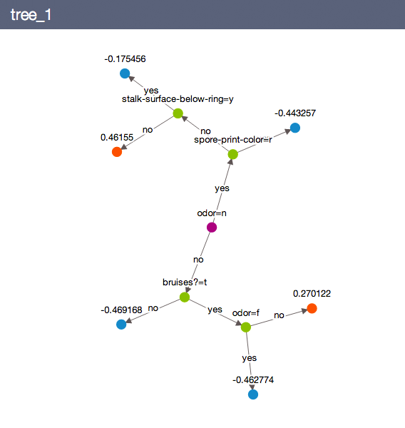

<script src="../turi/js/recview.js"></script>
# Random Forest Regression 
The Random Forest is one of the most effective machine learning
models for predictive analytics, making it an industrial workhorse for
machine learning.

##### Background
The **random forest** model is a type of additive model that makes predictions
by combining decisions from a sequence of base models. More formally we can
write this class of models as:

$$
    g(x) = f_0(x) + f_1(x) + f_2(x) + ...
$$

where the final model $$g$$ is the sum of simple base models $$f_i$$. Here,
each base classifier is a simple [decision
tree](decision_tree_regression.md).  This broad technique of
using multiple models to obtain better predictive performance is called
[**model ensembling**](http://en.wikipedia.org/wiki/Ensemble_learning).  In
random forests, all the base models are constructed independently using a
**different subsample** of the data.

##### Introductory Example

```python
import graphlab as gl

# Load the data
data =  gl.SFrame.read_csv('https://static.turi.com/datasets/xgboost/mushroom.csv')

# Label 'p' is edible
data['label'] = data['label'] == 'p'

# Make a train-test split
train_data, test_data = data.random_split(0.8)

# Create a model.
model = gl.random_forest_regression.create(train_data, target='label',
                                           max_iterations=2,
                                           max_depth =  3)

# Save predictions to an SArray
predictions = model.predict(test_data)

# Evaluate the model and save the results into a dictionary
results = model.evaluate(test_data)
```
We can visualize the models using

```python
model.show(view="Tree", tree_id=0)
model.show(view="Tree", tree_id=1)
```



##### Tuning hyperparameters
The Gradient oosted Trees model has many tuning parameters. Here we provide a simple guideline for tuning the model.

- **num_trees**
  Controls the number of trees in the final model. Usually the more trees, the
  higher accuracy.  However, both the training and prediction time also grows
  linearly in the number of trees.

- **max_depth**
  Restricts the depth of each individual tree to prevent overfitting.

- **step_size**
  Also called shrinkage, appeared as the $$\eta$$ in the equations in the
  background section.  It works similar to the learning rate of the gradient
  descent procedure: smaller value will take more iterations to reach the same
  level of training error of a larger step size.  So there is a trade off
  between step_size and number of iterations.

- **min_child_weight**
  One of the pruning criteria for decision tree construction. In classification
  problem, this corresponds to the minimum observations required at a leaf
  node. Larger value produces simpler trees.

- **min_loss_reduction**
  Another pruning criteria for decision tree construction. This restricts the
  reduction of loss function for a node split. Larger value produces simpler
  trees.

- **row_subsample**
  Use only a fraction of data at each iteration. This is similar to the
  mini-batch [stochastic gradient
  descent](http://en.wikipedia.org/wiki/Stochastic_gradient_descent) which not
  only reduce the computation cost of each iteration, but may also produce more
  robust model.

- **column_subsample**
  Use only a subset of the columns to use at each iteration.

In general, you can choose *num_trees* to be as large as your computation
budget permits.  You can then set *min_child_weight* to be a reasonable value
around (#instances/1000), and tune *max_depth*. When you have more training
instances, you can set *max_depth* to a higher value. When you find a large gap
between the training loss and validation loss, a sign of overfitting, you may
want to reduce depth, and increase *min_child_weight*.

##### Why chose random forests?

Different kinds of models have different advantages. The random forest model is
very good at handling tabular data with numerical features, or categorical
features with fewer than hundreds of categories. Unlike linear models, 
random forests are able to capture non-linear interaction between the
features and the target.

One important note is that tree based models are not designed to work with very
sparse features. When dealing with sparse input data (e.g. categorical features
with large dimension), we can either pre-process the sparse features to
generate numerical statistics, or switch to a linear model, which is better
suited for such scenarios.

##### Advanced Features

Refer to the earlier chapters for the following features:

* [Using categorical features](linear-regression.md#linregr-categorical-features)
* [Sparse features](linear-regression.md#linregr-sparse-features)
* [List features](linear-regression.md#linregr-list-features)
* [Evaluating Results](logistic-regression.md#logregr-evaluation)
